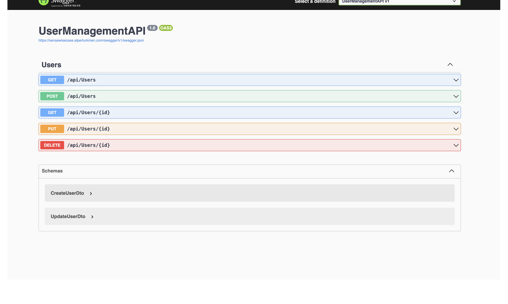

# User Management API

.NET Core 6 ile geliştirilmiş PostgreSQL kullanan kullanıcı yönetim API

## https://usermanagement.alperturkmen.com/swagger/index.html
## https://sensewisecase.alperturkmen.com/swagger/index.html
## Adreslerinde Docker ve Nginx ile yayınlanmıştır.




## Özellikler

- Kullanıcı CRUD işlemleri (Ekleme, Listeleme, Güncelleme, Silme)
- CQRS pattern ile temiz mimari
- PostgreSQL veritabanı (Code-First)
- Entity Framework Core
- Validasyon ve hata yönetimi
- Swagger dokümantasyonu

## Kurulum

### Gereksinimler
- .NET 6 SDK
- PostgreSQL

### Adımlar

1. Projeyi klonlayın
2. NuGet paketlerini yükleyin: `dotnet restore`
3. `appsettings.json`'da PostgreSQL connection string'ini güncelleyin
4. Uygulamayı çalıştırın: `dotnet run`

## API Endpointleri

GET  `/api/users`  Kullanıcıları listele (sayfalama) 
GET  `/api/users/{id}`  ID'ye göre kullanıcı getir 
POST  `/api/users`  Yeni kullanıcı oluştur 
PUT  `/api/users/{id}`  Kullanıcıyı güncelle 
DELETE  `/api/users/{id}`  Kullanıcıyı sil 

## Validasyon Kuralları

### Zorunlu Alanlar
- **Ad**: Maksimum 100 karakter
- **Soyad**: Maksimum 100 karakter
- **Email**: Geçerli format, benzersiz, maksimum 200 karakter

### Opsiyonel Alanlar
- **Adres**: Maksimum 500 karakter

## DB Yapılandırma

`appsettings.json`:
```json
{
  "ConnectionStrings": {
    "DefaultConnection": "Host=localhost;Database=UserManagementDb;Username=postgres;Password=1234"
  }
}
```

## Teknolojiler

- .NET Core 6
- Entity Framework Core 6.0
- PostgreSQL
- Swagger/OpenAPI